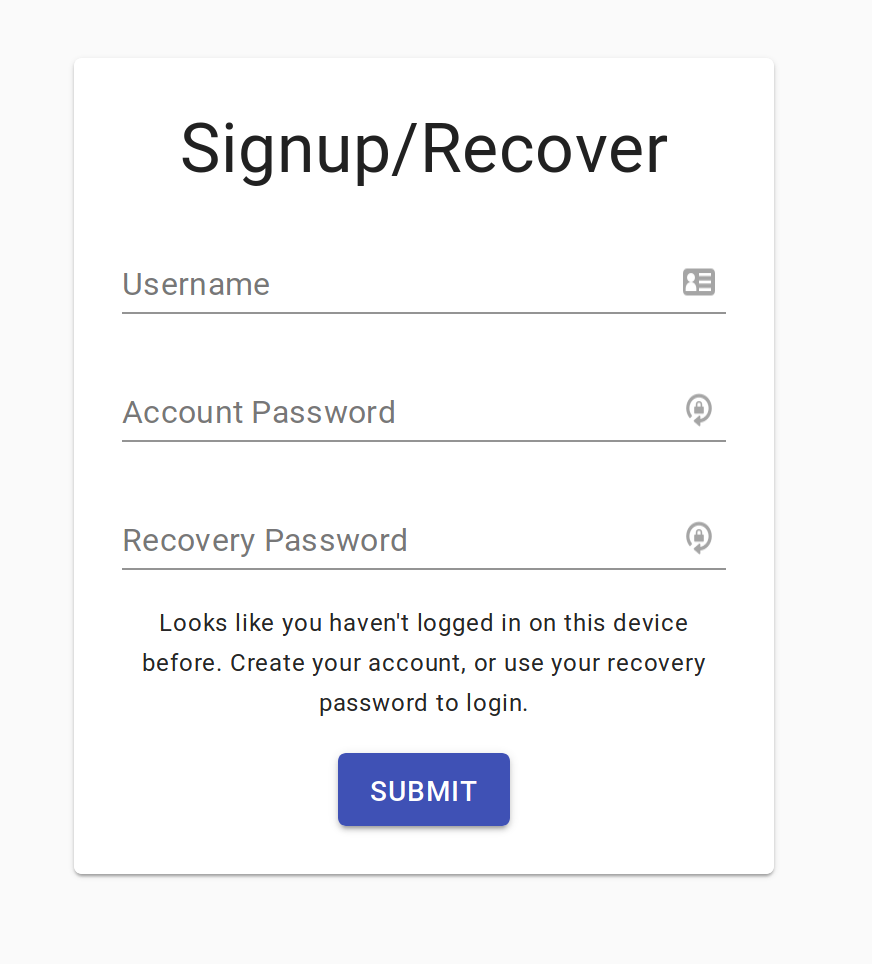

# Identity Proof of Concept

Here's a brief rundown of the architecture and setup behind our identity proof of concept that we just launched 

Check out the app here: https://safe.fission.name/

## Overview
The goal of this application to to equip a user with a private key while providing UX similar to a traditional web app. 

In the demo application, a user stores a private note in IPFS that is encrypted/decrypted with their private key.

For the first iteration of our identity system, we decided to use the [ZeroWallet](http://zerowallet.me/) scheme. 

## ZeroWallet
ZeroWallet is a simple scheme where a user generates a private key with two passwords, and unlocks their account on login using just a username and password.

It makes use of [Shamir's Secret Sharing](https://en.wikipedia.org/wiki/Shamir%27s_Secret_Sharing) and [zero-knowledge proofs](https://en.wikipedia.org/wiki/Zero-knowledge_proof) to allow recovery of private keys.

ZeroWallet uses 2 passwords and 3 shards. Any 2 shards can reconstruct the `privateKey`.

As a brief overview of the components:
- **account password**: this is the password that a user generally uses to login to their account. Imagine a normal username/password signin
- **recovery password**: this is the password that a user uses to recover their private key
- **shard1**: this shard is just a hash of the account password (`shard1 = sha256(accountPassword)`)
- **shard2**: this is the fancy part of the scheme that makes use of zero-knowledge proofs. You can read more about the nitty gritty details [Here](https://medium.com/@amanladia1/zerowallet-a-zkp-based-wallet-authentication-mechanism-9871dcca0a01). For the purpose here, think of it as `shard2 = serverTransform(sha256(recoveryPassword))`. What actually happens is similar to [Diffie-Hellman key exchange](https://en.wikipedia.org/wiki/Diffie%E2%80%93Hellman_key_exchange). The important part of this is that the server gets no information about the user's share (`sha256(recoveryPassword)`), and a malicious hacker gets no information about the server's share by sending spoof requests.
- **shard3**: this shard is derived from the first two using Shamir's Secret Sharing (SSS). SSS can come up with an essentially endless number of shards for a given private key. So `shard3` is actually unique per-device

**Signup** flow (_I'm totally new here_)
- user enters, `username`, `accountPassword`, and `recoveryPassword`
- `recoveryPassword` is hashed and "randomized" into a value we'll call `alpha`, then sent to the server
- the server generates an arbitrary 256-bit key `zk_key`. 
- `zk_key` is combined with `alpha` to produce `beta` which is sent back to the user
- `beta` is "derandomized" to produce `shard2`
- user generates `shard1 = sha256(accountPassword)`
- user acquires `privateKey = SSS.combine(shard1, shard2)`
- user generates `shard3 = SSS.newShard(privateKey`)
- user stores `shard3` in `localStorage` and logs into the safe

**Login** flow (_I've already logged onto this device before_)
- user enters `username` and `accountPassword`
- user generates `shard1 = sha256(accountPassword)`
- user gets `shard3` from `localStorage`
- user acquires `privateKey = SSS.combine(shard1, shard3)` and loogs into the safe

**Recovery** flow (_I want to login on a new device_)
- This is the exact same flow as **Signup** except that the server uses the `zk_key` that's already in the database

## Encryption
If a user is only encrypting data for themselves, they can just encrypt/decrypt it with their `privateKey`. However, we wanted to built this in such a way that a "sharing" or "social" component could easily be added.

To do this, you don't want to have to re-encrypt your note for every friend that you want to share it with. This leads to a lot of data replication, and also puts a big load on the user since everytime they edit the note, it must be re-encrypted for every one of their friends.

Instead, we encrypt the note with a symmetric key (`cipherKey`). Add the cipher text to IPFS. And then encrypt the `cipherKey` with the user's `privateKey`. Now, we have a simple setup that can be easily expanded to shared notes. If I want to share a note with you, I don't have to re-encrypt the entire note for your `publicKey`. I just have to encrypt and send you the `cipherKey`

## Keystore
I separated all "key" functionality into it's own module: `keystore`. Any code that touches private keys is always susceptible to attack (malicious packages, etc). We've discussed writing this module using WASM which essentially gives us a secure "black box" that other parts of our code can't acess, keeping these keys safe.

## Database
For the time being, we store just 4 things in the database: `username`, `zk_key`, `safe_cid`, and `safe_key`.

The first two are for ZeroWallet. `username` is self-explanatory, `zk_key` is the server's "share" of the second shard of the user's `privateKey`. By itself, it reveals absolutely nothing about the second shard, but it can be used to transform the user's recovery password in such a manner that they can recover the second shard without revealing any information to the server.

`safe_cid` is the current CID of the encrypted safe, and `safe_key` is an encrypted `cipherKey` for the safe. `safe_cid` and `safe_key` are currently stored in our database for convenience sake, but would eventually be moved to some form of decentralized storage (OrbitDB spike coming as we speak!)
